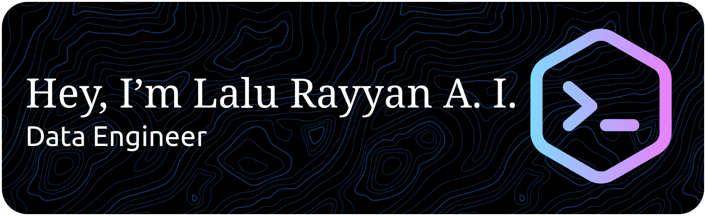

  
  
  

---

  Data Engineer with a strong analytical foundation from experience as a Warehouse Analyst, complemented by freelance and personal projects focused on building scalable data pipelines, automating ETL processes, and processing large-scale datasets using Python, SQL, Airflow, Spark, and Hadoop

<!--
**RayyanAkbar/RayyanAKbar** is a ✨ _special_ ✨ repository because its `README.md` (this file) appears on your GitHub profile.

Here are some ideas to get you started:

- 🔭 I’m currently working on ...
- 🌱 I’m currently learning ...
- 👯 I’m looking to collaborate on ...
- 🤔 I’m looking for help with ...
- 💬 Ask me about ...
- 📫 How to reach me: ...
- 😄 Pronouns: ...
- ⚡ Fun fact: ...
-->

